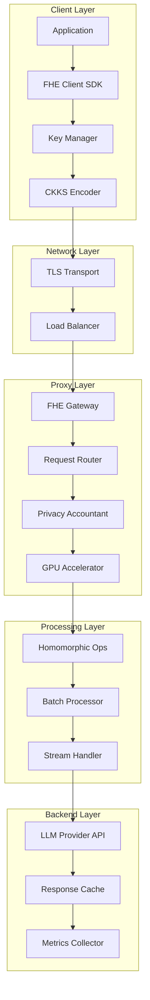
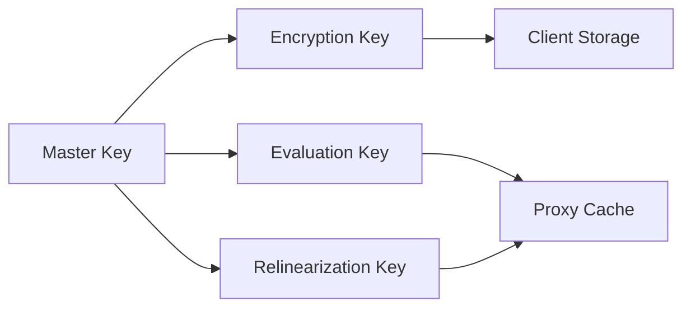

# Architecture Overview

## System Architecture

The Homomorphic LLM Proxy is designed as a privacy-preserving gateway that enables secure LLM inference without exposing plaintext data to untrusted cloud infrastructure.

### Core Components



### Data Flow

1. **Encryption Phase**
   - Client generates CKKS encryption keys
   - Plaintext prompt encoded into polynomial representation
   - Ciphertext transmitted over TLS to proxy

2. **Processing Phase**
   - Proxy validates encryption parameters
   - Privacy budget checked and allocated
   - Homomorphic operations performed on GPU
   - Encrypted data forwarded to LLM provider

3. **Response Phase**
   - Encrypted response received from provider
   - Optional caching of encrypted responses
   - Streaming decryption for real-time output
   - Privacy budget updated

### Security Architecture

#### Threat Model
- **Assumptions**: Client and key storage are trusted
- **Adversary**: Honest-but-curious cloud provider
- **Guarantees**: Computational indistinguishability under chosen plaintext attack

#### Key Management


### Performance Optimizations

#### GPU Acceleration
- Custom CUDA kernels for polynomial arithmetic
- Batched operations for throughput optimization
- Memory-mapped I/O for large ciphertexts

#### Caching Strategy
- Encrypted response caching with TTL
- Key rotation with graceful degradation
- LRU eviction for memory management

### Scalability Design

#### Horizontal Scaling
- Stateless proxy design enables load balancing
- Session affinity for stream consistency
- Distributed key storage with Redis cluster

#### Resource Management
- GPU memory pooling across requests
- Dynamic batch sizing based on load
- Circuit breaker for overload protection

## Technology Stack

### Core Technologies
- **Rust**: High-performance proxy implementation
- **CUDA**: GPU acceleration for FHE operations
- **Python**: Client SDK and ML integrations
- **FastAPI**: HTTP API framework

### Encryption Libraries
- **Microsoft SEAL**: CKKS scheme implementation
- **cuFHE**: GPU-accelerated FHE operations
- **Custom Kernels**: Optimized polynomial arithmetic

### Infrastructure
- **Docker**: Containerization and deployment
- **Kubernetes**: Orchestration and scaling
- **Redis**: Session storage and caching
- **Prometheus**: Metrics collection

## Deployment Architecture

### Development Environment
```yaml
services:
  proxy:
    build: .
    ports: ["8080:8080"]
    environment:
      - RUST_LOG=debug
    depends_on: [redis]
  
  redis:
    image: redis:alpine
    ports: ["6379:6379"]
```

### Production Environment
```yaml
apiVersion: v1
kind: Namespace
metadata:
  name: fhe-proxy
---
apiVersion: apps/v1
kind: Deployment
metadata:
  name: fhe-gateway
spec:
  replicas: 3
  selector:
    matchLabels:
      app: fhe-gateway
  template:
    spec:
      containers:
      - name: gateway
        image: fhe-llm-proxy:latest
        resources:
          limits:
            nvidia.com/gpu: 1
            memory: 8Gi
          requests:
            cpu: 2000m
            memory: 4Gi
```

## Quality Attributes

### Performance Requirements
- **Latency**: <4x overhead compared to plaintext
- **Throughput**: 100+ concurrent requests per GPU
- **Memory**: <8GB GPU memory for production workloads

### Security Requirements
- **Encryption**: 128-bit security level
- **Key Rotation**: Every 24 hours
- **Privacy**: Differential privacy with configurable epsilon

### Reliability Requirements
- **Availability**: 99.9% uptime SLA
- **Recovery**: <30 second failover time
- **Backup**: Encrypted key backup with 3-2-1 strategy

## Integration Points

### Client Integrations
- LangChain wrapper for transparent encryption
- OpenAI SDK compatibility layer
- FastAPI middleware for existing applications

### Provider Integrations
- OpenAI API adapter
- Anthropic Claude adapter
- Hugging Face Hub connector
- Custom provider interface

### Monitoring Integrations
- Prometheus metrics export
- OpenTelemetry tracing
- Custom privacy budget dashboards

## Future Architecture Considerations

### Planned Enhancements
- **TFHE Support**: For more complex computations
- **TPU Acceleration**: Alternative to GPU processing
- **Multi-Party Computation**: Threshold decryption
- **Zero-Knowledge Proofs**: Enhanced privacy guarantees

### Scalability Roadmap
- **Federated Deployment**: Multi-region support
- **Edge Computing**: Client-side preprocessing
- **Quantum Resistance**: Post-quantum cryptography

## Development Lifecycle

### Development Workflow
- **Version Control**: Git with conventional commits
- **Branching Strategy**: GitHub Flow (feature → main)
- **Code Review**: Required PR reviews with automated checks
- **Testing Strategy**: Unit, integration, and security testing

### CI/CD Pipeline
- **Continuous Integration**: Automated testing and quality checks
- **Security Scanning**: Dependency and vulnerability analysis
- **Deployment**: Containerized deployments with rollback capability
- **Monitoring**: Real-time performance and security metrics

### Quality Assurance
- **Code Standards**: Automated linting and formatting
- **Security Reviews**: Regular security assessments
- **Performance Testing**: Load testing and benchmarking
- **Documentation**: Automated documentation generation and updates

### Release Management
- **Semantic Versioning**: Automated version management
- **Release Notes**: Generated from conventional commits
- **Rollback Strategy**: Blue-green deployments with quick rollback
- **Change Management**: Structured release approval process

### Compliance and Governance
- **Security Policies**: Defined security requirements and procedures
- **Privacy Controls**: Data handling and retention policies
- **Audit Trail**: Comprehensive logging and monitoring
- **Risk Management**: Regular security and operational risk assessments