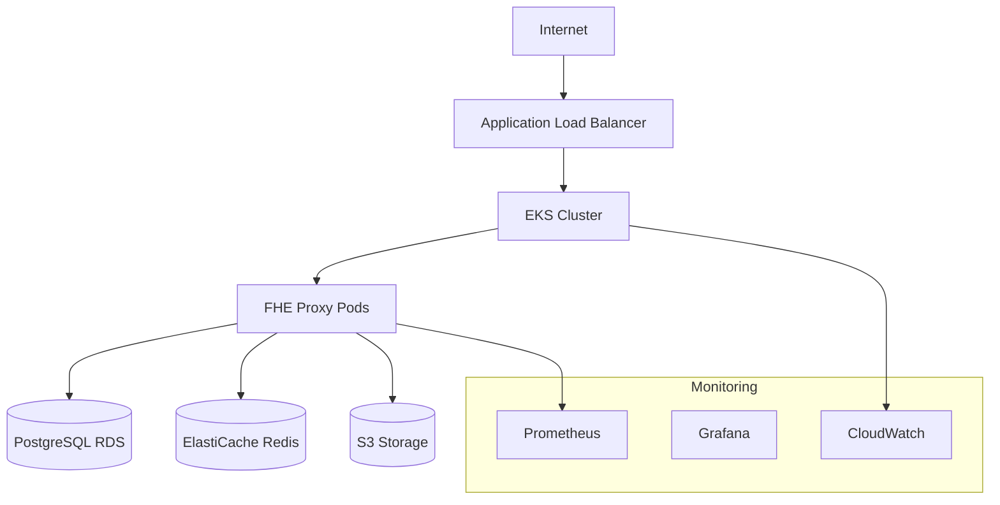

# FHE LLM Proxy - Production Deployment Guide

This directory contains production-ready deployment configurations for the Homomorphic LLM Proxy across multiple platforms and environments.

## 🚀 Quick Start

### AWS Deployment (Recommended)

```bash
# Set required environment variables
export ENVIRONMENT=production
export AWS_REGION=us-west-2
export DOMAIN_NAME=your-domain.com
export DB_PASSWORD=$(openssl rand -base64 32)
export REDIS_AUTH_TOKEN=$(openssl rand -base64 32)
export MASTER_API_KEY=$(openssl rand -base64 32)
export JWT_SECRET=$(openssl rand -base64 32)

# Deploy to AWS
cd deployment/aws
./deploy.sh --environment production --domain your-domain.com
```

### Docker Swarm Deployment

```bash
# Initialize Docker Swarm
docker swarm init

# Create secrets
echo "your-jwt-secret" | docker secret create fhe_proxy_jwt_secret -
echo "your-master-api-key" | docker secret create fhe_proxy_master_api_key -
echo "your-openai-key" | docker secret create fhe_proxy_openai_api_key -
echo "your-postgres-password" | docker secret create fhe_proxy_postgres_password -

# Deploy stack
docker stack deploy -c docker-compose.production.yml fhe-proxy
```

## 📁 Directory Structure

```
deployment/
├── aws/                          # AWS deployment with Terraform
│   ├── terraform/               # Terraform infrastructure code
│   │   ├── main.tf             # Main infrastructure configuration
│   │   ├── variables.tf        # Input variables
│   │   ├── outputs.tf          # Output values
│   │   └── iam.tf              # IAM roles and policies
│   └── deploy.sh               # Automated deployment script
├── docker-compose.production.yml # Production Docker Compose
├── kubernetes/                   # Kubernetes manifests
├── azure/                       # Azure deployment (future)
├── gcp/                         # Google Cloud deployment (future)
└── README.md                    # This file
```

## 🏗️ Architecture Overview

### AWS Architecture



### Key Components

1. **EKS Cluster**: Managed Kubernetes for container orchestration
2. **GPU Nodes**: P3/P4 instances for FHE computations
3. **RDS PostgreSQL**: Managed database for persistent data
4. **ElastiCache Redis**: In-memory cache for performance
5. **Application Load Balancer**: Traffic distribution and SSL termination
6. **WAF**: Web Application Firewall for security
7. **ECR**: Container registry for Docker images
8. **S3**: Object storage for artifacts and backups

## 🔧 Configuration

### Environment Variables

| Variable | Description | Required | Default |
|----------|-------------|----------|---------|
| `ENVIRONMENT` | Deployment environment | Yes | - |
| `AWS_REGION` | AWS region | Yes | us-west-2 |
| `DOMAIN_NAME` | Application domain | Yes | - |
| `DB_PASSWORD` | Database password | Yes | - |
| `REDIS_AUTH_TOKEN` | Redis authentication token | Yes | - |
| `MASTER_API_KEY` | Master API key | Yes | - |
| `JWT_SECRET` | JWT signing secret | Yes | - |
| `OPENAI_API_KEY` | OpenAI API key | No | - |
| `ANTHROPIC_API_KEY` | Anthropic API key | No | - |

### Infrastructure Sizing

#### Development Environment
- **EKS Nodes**: 2x t3.large (2 vCPU, 8GB RAM)
- **RDS**: db.t3.micro (1 vCPU, 1GB RAM)
- **ElastiCache**: cache.t3.micro (1 vCPU, 0.5GB RAM)

#### Production Environment
- **EKS Nodes**: 3x p3.2xlarge (8 vCPU, 61GB RAM, 1 GPU)
- **RDS**: db.r6g.large (2 vCPU, 16GB RAM)
- **ElastiCache**: cache.r6g.large (2 vCPU, 13GB RAM)

## 🔐 Security

### Network Security
- Private subnets for all workloads
- Security groups with minimal required access
- WAF protection against common attacks
- VPC endpoints for AWS services

### Data Security
- Encryption at rest for all storage
- Encryption in transit with TLS 1.3
- KMS key management
- Secrets stored in AWS Secrets Manager

### Access Control
- IAM roles with least privilege principle
- RBAC for Kubernetes
- API key authentication
- JWT token validation

## 📊 Monitoring & Observability

### Metrics
- **Prometheus**: Application and infrastructure metrics
- **Grafana**: Visualization dashboards
- **CloudWatch**: AWS service metrics
- **Custom Metrics**: FHE operation performance

### Logging
- **Structured Logging**: JSON format with correlation IDs
- **Log Aggregation**: CloudWatch Logs
- **Log Retention**: 30 days for production

### Tracing
- **Distributed Tracing**: Jaeger integration
- **Request Tracing**: End-to-end request tracking
- **Performance Profiling**: FHE operation timing

### Alerting
- **Critical Alerts**: PagerDuty integration
- **Warning Alerts**: Slack notifications
- **SLA Monitoring**: 99.9% uptime target

## 🔄 CI/CD Pipeline

### Build Process
1. **Code Quality**: Linting, formatting, security scanning
2. **Testing**: Unit, integration, and load tests
3. **Image Building**: Multi-stage Docker builds
4. **Security Scanning**: Container vulnerability scanning
5. **Image Signing**: SLSA compliance

### Deployment Process
1. **Infrastructure**: Terraform plan and apply
2. **Application**: Rolling deployment with health checks
3. **Smoke Tests**: Post-deployment validation
4. **Monitoring**: Alert validation and dashboard checks

### Rollback Strategy
- **Automated Rollback**: On health check failures
- **Manual Rollback**: One-command rollback capability
- **Database Migrations**: Reversible migration strategy

## 🚀 Performance Optimization

### FHE Performance
- **GPU Acceleration**: CUDA-enabled containers
- **Memory Optimization**: Efficient ciphertext caching
- **Batch Processing**: Multiple operations per request
- **Connection Pooling**: Database and Redis connections

### Scaling Strategy
- **Horizontal Pod Autoscaler**: CPU and memory based
- **Cluster Autoscaler**: Node scaling based on demand
- **Vertical Pod Autoscaler**: Right-sizing containers
- **Load Balancing**: Intelligent request distribution

## 💾 Backup & Disaster Recovery

### Backup Strategy
- **RDS Automated Backups**: 7-day retention
- **Point-in-Time Recovery**: Up to 35 days
- **Cross-Region Backups**: For disaster recovery
- **Application Data**: S3 with versioning

### Disaster Recovery
- **RTO**: 4 hours (Recovery Time Objective)
- **RPO**: 1 hour (Recovery Point Objective)
- **Multi-AZ Deployment**: High availability
- **Cross-Region Replication**: Disaster recovery

## 🔍 Troubleshooting

### Common Issues

#### Pod Startup Failures
```bash
# Check pod status
kubectl get pods -n fhe-proxy

# Check pod logs
kubectl logs <pod-name> -n fhe-proxy

# Describe pod for events
kubectl describe pod <pod-name> -n fhe-proxy
```

#### Database Connection Issues
```bash
# Test database connectivity
kubectl run -it --rm debug --image=postgres:15 --restart=Never -- psql -h <rds-endpoint> -U <username> -d <database>

# Check security groups
aws ec2 describe-security-groups --group-ids <sg-id>
```

#### Performance Issues
```bash
# Check resource usage
kubectl top pods -n fhe-proxy
kubectl top nodes

# Check HPA status
kubectl get hpa -n fhe-proxy

# View metrics
curl http://<service-ip>:9090/metrics
```

### Health Checks

#### Application Health
```bash
# Health endpoint
curl https://your-domain.com/health

# Metrics endpoint
curl https://your-domain.com/metrics

# Readiness probe
kubectl get pods -n fhe-proxy -o wide
```

#### Infrastructure Health
```bash
# EKS cluster status
aws eks describe-cluster --name <cluster-name>

# RDS status
aws rds describe-db-instances --db-instance-identifier <instance-id>

# ElastiCache status
aws elasticache describe-cache-clusters --cache-cluster-id <cluster-id>
```

## 📞 Support

### Documentation
- [Architecture Guide](../docs/ARCHITECTURE.md)
- [Security Guide](../docs/SECURITY_ARCHITECTURE.md)
- [Development Guide](../docs/DEVELOPMENT.md)
- [API Documentation](../API_DOCUMENTATION.md)

### Monitoring Dashboards
- **Application**: https://grafana.your-domain.com
- **Infrastructure**: AWS CloudWatch Console
- **Traces**: https://jaeger.your-domain.com

### Emergency Contacts
- **On-Call Engineer**: PagerDuty escalation
- **DevOps Team**: Slack #devops-alerts
- **Security Team**: security@terragonlabs.com

## 📝 Maintenance

### Regular Tasks
- **Security Updates**: Monthly patching schedule
- **Certificate Renewal**: Automated via Let's Encrypt
- **Backup Verification**: Weekly restore tests
- **Performance Review**: Monthly capacity planning

### Upgrade Process
1. **Test Environment**: Deploy and validate changes
2. **Staging Environment**: Production-like testing
3. **Blue-Green Deployment**: Zero-downtime updates
4. **Post-Deployment**: Monitoring and validation

## 📄 Compliance

### Security Standards
- **SOC 2 Type II**: Security controls audit
- **GDPR**: Data protection compliance
- **HIPAA**: Healthcare data security (if applicable)
- **ISO 27001**: Information security management

### Audit Logging
- **API Access**: All API requests logged
- **Admin Actions**: Privileged operations tracked
- **Data Access**: Database query logging
- **Security Events**: Failed authentication attempts

---

For more information, please refer to the [Project Documentation](../README.md) or contact the development team.