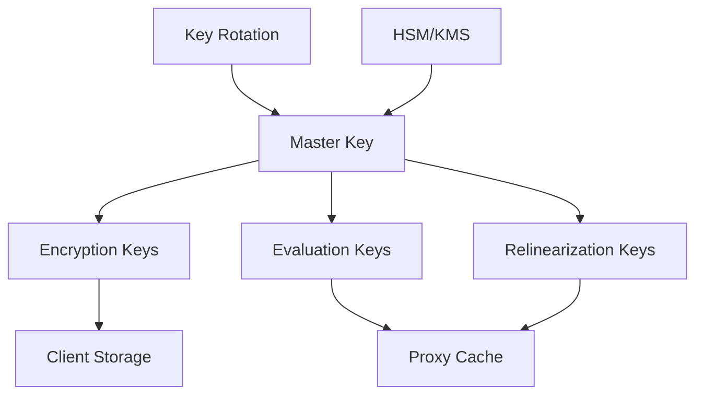

# Security Architecture

This document describes the comprehensive security architecture and threat model for the Homomorphic LLM Proxy.

## Security Objectives

### Primary Security Goals
1. **Confidentiality**: Protect plaintext data from unauthorized access
2. **Integrity**: Ensure data hasn't been tampered with during processing
3. **Availability**: Maintain service availability under attack
4. **Privacy**: Prevent inference attacks on user data
5. **Compliance**: Meet regulatory requirements (GDPR, HIPAA, etc.)

### Threat Model

#### Assumptions
- **Trusted Components**: Client applications, key management systems
- **Semi-Trusted**: Proxy server (honest-but-curious)
- **Untrusted**: Cloud infrastructure, network, LLM providers
- **Adversary Model**: Computationally bounded, passive eavesdropping, active attacks on network

#### Protected Assets
- User prompts and responses
- Encryption keys
- Privacy budget information
- System configurations
- Business logic

## Cryptographic Architecture

### Homomorphic Encryption Scheme
```
Primary Scheme: CKKS (Cheon-Kim-Kim-Song)
- Security Level: 128-bit minimum
- Ring Dimension: 16384 (configurable)
- Modulus Chain: Optimized for depth and precision
- Noise Management: Bootstrapping when necessary
```

### Key Management


#### Key Lifecycle
1. **Generation**: Cryptographically secure random generation
2. **Distribution**: Secure channel establishment
3. **Storage**: Hardware Security Module (HSM) or cloud KMS
4. **Rotation**: Automated 24-hour rotation cycle
5. **Revocation**: Immediate invalidation on compromise

### Cryptographic Protocols

#### Client-Proxy Protocol
```
1. Key Exchange:
   Client → Proxy: ECDH key establishment
   Proxy → Client: Session parameters

2. Encryption:
   Client: plaintext → CKKS(plaintext, public_key)
   Client → Proxy: encrypted_prompt

3. Processing:
   Proxy: homomorphic_operations(encrypted_prompt)
   Proxy → LLM: encrypted_data

4. Response:
   LLM → Proxy: encrypted_response
   Proxy → Client: encrypted_response
   Client: CKKS_decrypt(encrypted_response, private_key)
```

#### Privacy Budget Protocol
```
1. Budget Allocation:
   ε_total = 10.0 (configurable)
   ε_per_query = 0.1 (adaptive)

2. Budget Tracking:
   current_budget = ε_total - Σ(ε_consumed)
   
3. Query Authorization:
   if (ε_query ≤ current_budget):
       authorize_query()
   else:
       reject_query()
```

## Security Controls

### Access Controls
- **Authentication**: mTLS client certificates
- **Authorization**: RBAC with least-privilege principle
- **API Security**: Rate limiting, input validation
- **Session Management**: Secure session tokens with expiration

### Data Protection
- **Encryption at Rest**: AES-256-GCM for persistent data
- **Encryption in Transit**: TLS 1.3 for all communications
- **Memory Protection**: Secure memory allocation for keys
- **Data Residency**: Configurable geographic restrictions

### Infrastructure Security
- **Container Security**: Distroless base images, non-root execution
- **Network Security**: Private networks, firewall rules
- **Secrets Management**: External secret stores (Vault, KMS)
- **Monitoring**: Security event logging and alerting

## Threat Analysis

### Attack Vectors and Mitigations

#### 1. Passive Eavesdropping
**Threat**: Network traffic interception
**Mitigation**: 
- TLS 1.3 encryption for all communications
- Certificate pinning for critical connections
- Perfect forward secrecy

#### 2. Active Network Attacks
**Threat**: Man-in-the-middle, replay attacks
**Mitigation**:
- Mutual TLS authentication
- Request timestamps and nonces
- Message authentication codes

#### 3. Side-Channel Attacks
**Threat**: Timing, power, electromagnetic analysis
**Mitigation**:
- Constant-time operations where possible
- Noise injection for timing normalization
- Physical security for critical components

#### 4. Cryptographic Attacks
**Threat**: Key recovery, ciphertext manipulation
**Mitigation**:
- Proven secure FHE schemes
- Regular security audits
- Key rotation policies

#### 5. Privacy Attacks
**Threat**: Statistical inference, correlation attacks
**Mitigation**:
- Differential privacy mechanisms
- Privacy budget enforcement
- Query result anonymization

#### 6. Denial of Service
**Threat**: Resource exhaustion, availability attacks
**Mitigation**:
- Rate limiting and throttling
- Resource quotas and monitoring
- Auto-scaling and load balancing

## Compliance Framework

### Regulatory Compliance

#### GDPR (General Data Protection Regulation)
- **Data Minimization**: Only necessary data processed
- **Purpose Limitation**: Clear processing purposes
- **Right to Erasure**: Data deletion capabilities
- **Privacy by Design**: Built-in privacy protections

#### HIPAA (Health Insurance Portability and Accountability Act)
- **Administrative Safeguards**: Access controls and training
- **Physical Safeguards**: Facility access and workstation security
- **Technical Safeguards**: Encryption and audit controls

#### SOC 2 Type II
- **Security**: Unauthorized access protection
- **Availability**: System availability and performance
- **Processing Integrity**: Complete and accurate processing
- **Confidentiality**: Designated confidential information protection

### Security Standards

#### ISO 27001/27002
- Information Security Management System (ISMS)
- Risk assessment and treatment
- Security control implementation
- Continuous improvement process

#### NIST Cybersecurity Framework
- **Identify**: Asset management and risk assessment
- **Protect**: Access controls and data security
- **Detect**: Security monitoring and anomaly detection
- **Respond**: Incident response and recovery
- **Recover**: Business continuity and disaster recovery

## Security Monitoring

### Security Event Logging
```json
{
  "timestamp": "2024-07-29T10:00:00Z",
  "event_type": "authentication_failure",
  "source_ip": "192.168.1.100",
  "user_id": "user123",
  "severity": "medium",
  "details": {
    "reason": "invalid_certificate",
    "attempts": 3
  }
}
```

### Security Metrics
- Authentication success/failure rates
- Encryption key usage and rotation
- Privacy budget consumption
- Security event frequency and severity
- Compliance audit results

### Incident Response
1. **Detection**: Automated alerts and monitoring
2. **Analysis**: Threat assessment and impact evaluation
3. **Containment**: Immediate threat mitigation
4. **Eradication**: Root cause elimination
5. **Recovery**: Service restoration and validation
6. **Lessons Learned**: Process improvement

## Security Testing

### Penetration Testing
- **Frequency**: Quarterly external assessments
- **Scope**: All external interfaces and critical components
- **Methods**: OWASP Top 10, custom cryptographic tests
- **Reporting**: Detailed findings with remediation timelines

### Vulnerability Management
- **Scanning**: Automated daily vulnerability scans
- **Assessment**: Risk-based vulnerability prioritization
- **Remediation**: Defined SLAs for vulnerability fixes
- **Verification**: Post-remediation testing

### Security Audits
- **Code Audits**: Static and dynamic analysis
- **Cryptographic Review**: Expert cryptographic assessment
- **Configuration Review**: Security configuration validation
- **Compliance Audits**: Regulatory requirement verification

## Business Continuity

### Disaster Recovery
- **Recovery Time Objective (RTO)**: 4 hours
- **Recovery Point Objective (RPO)**: 1 hour
- **Backup Strategy**: Encrypted backups in multiple regions
- **Testing**: Monthly disaster recovery drills

### Business Continuity Planning
- **Risk Assessment**: Business impact analysis
- **Continuity Strategies**: Alternative processing sites
- **Communication Plans**: Stakeholder notification procedures
- **Testing and Maintenance**: Regular plan updates and testing

## Security Governance

### Security Organization
- **Chief Security Officer**: Overall security accountability
- **Security Team**: Day-to-day security operations
- **Security Committee**: Strategic security decisions
- **Security Champions**: Embedded security expertise

### Policy and Procedures
- Information Security Policy
- Data Classification and Handling
- Incident Response Procedures
- Security Training and Awareness
- Vendor Security Requirements

### Security Metrics and Reporting
- Monthly security dashboards
- Quarterly security reviews
- Annual security assessments
- Board-level security reporting

## Implementation Roadmap

### Phase 1: Foundation (Months 1-3)
- Core cryptographic implementation
- Basic access controls
- Security logging infrastructure

### Phase 2: Enhancement (Months 4-6)
- Advanced threat detection
- Compliance framework implementation
- Security testing integration

### Phase 3: Optimization (Months 7-9)
- Performance security optimization
- Advanced privacy features
- Security automation

### Phase 4: Maturity (Months 10-12)
- Continuous security improvement
- Advanced threat hunting
- Security innovation integration

This security architecture provides a comprehensive framework for protecting the Homomorphic LLM Proxy while maintaining high performance and regulatory compliance.