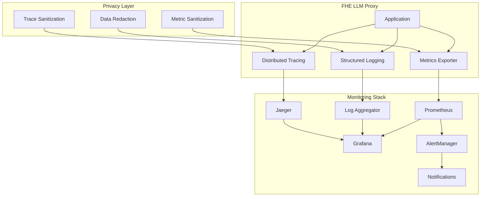

# Observability Guide

## Overview

This guide covers the comprehensive observability stack for the FHE LLM Proxy, including metrics, logging, tracing, and alerting.

## Architecture



## Metrics Collection

### Core Metrics

#### System Performance
- **CPU Usage**: Process and system-level CPU utilization
- **Memory Usage**: Heap, stack, and GPU memory consumption
- **Network I/O**: Request/response throughput and latency
- **Disk I/O**: Storage operations and queue depths

#### FHE-Specific Metrics
- **Encryption Latency**: Time to encrypt plaintext prompts
- **Decryption Latency**: Time to decrypt responses
- **Key Generation Time**: Duration of key generation operations
- **Homomorphic Operations**: Count and duration of HE operations

#### Privacy Metrics
- **Privacy Budget**: Remaining epsilon for differential privacy
- **Query Count**: Number of queries per user/session
- **Budget Consumption Rate**: Rate of privacy budget usage
- **Privacy Violations**: Detected privacy policy violations

#### GPU Metrics
- **GPU Utilization**: Compute and memory utilization
- **CUDA Memory**: Allocated and free GPU memory
- **Kernel Execution Time**: Duration of CUDA kernels
- **Batch Processing**: Batch sizes and throughput

### Metric Labels

```yaml
# Standard labels for all metrics
labels:
  service: "fhe-llm-proxy"
  version: "v0.2.0"
  environment: "production"
  region: "us-west-2"
  instance_id: "proxy-001"
  
# FHE-specific labels
fhe_labels:
  encryption_scheme: "ckks"
  security_level: "128"
  poly_modulus_degree: "16384"
  key_id: "key-abc123"
  
# Privacy labels
privacy_labels:
  user_id: "hashed_user_id"
  session_id: "session_123"
  privacy_level: "high"
```

### Custom Metrics

```rust
// Example metrics definition
use prometheus::{Counter, Histogram, Gauge};

lazy_static! {
    static ref ENCRYPTION_DURATION: Histogram = register_histogram!(
        "fhe_encryption_duration_seconds",
        "Time spent encrypting plaintext data",
        vec![0.001, 0.01, 0.1, 1.0, 10.0]
    ).unwrap();
    
    static ref PRIVACY_BUDGET_REMAINING: Gauge = register_gauge!(
        "fhe_privacy_budget_remaining",
        "Remaining privacy budget (epsilon) for user"
    ).unwrap();
    
    static ref HOMOMORPHIC_OPERATIONS_TOTAL: Counter = register_counter!(
        "fhe_homomorphic_operations_total",
        "Total number of homomorphic operations performed"
    ).unwrap();
}
```

## Logging

### Log Levels and Categories

#### Standard Levels
- **ERROR**: System errors, failed operations
- **WARN**: Performance degradation, recoverable issues  
- **INFO**: Normal operations, state changes
- **DEBUG**: Detailed operation information
- **TRACE**: Fine-grained execution details

#### Privacy-Aware Logging
```json
{
  "timestamp": "2024-01-15T10:30:00Z",
  "level": "INFO",
  "service": "fhe-llm-proxy",
  "operation": "encrypt_prompt",
  "user_id": "hash_abc123",
  "session_id": "sess_456",
  "encryption_scheme": "ckks",
  "ciphertext_size": 8192,
  "duration_ms": 150,
  "plaintext": "[REDACTED]",
  "private_key": "[REDACTED]"
}
```

### Log Redaction

```toml
# Observability configuration
[logging.privacy]
exclude_plaintext = true
redact_fields = [
    "private_key",
    "secret_key", 
    "plaintext",
    "user_data",
    "api_key",
    "token"
]
```

### Structured Logging

```rust
// Example structured logging
use tracing::{info, warn, error, instrument};

#[instrument(skip(plaintext, private_key))]
async fn encrypt_data(plaintext: &str, private_key: &PrivateKey) -> Result<Ciphertext> {
    let start = Instant::now();
    
    info!(
        ciphertext_size = ciphertext.size(),
        encryption_scheme = "ckks",
        "Encryption completed successfully"
    );
    
    ENCRYPTION_DURATION.observe(start.elapsed().as_secs_f64());
    
    Ok(ciphertext)
}
```

## Distributed Tracing

### Trace Spans

#### Request Flow Tracing
```
Root Span: HTTP Request
├── Authentication Span
├── Privacy Budget Check Span
├── Encryption Span
│   ├── Key Loading Span
│   ├── CKKS Encoding Span
│   └── GPU Computation Span
├── LLM Provider Span
│   ├── HTTP Client Span
│   └── Response Processing Span
└── Decryption Span
    ├── Noise Analysis Span
    └── Result Validation Span
```

#### Custom Spans
```rust
use tracing::{span, Level};

let encryption_span = span!(
    Level::INFO,
    "fhe_encryption",
    scheme = "ckks",
    security_level = 128,
    user_id = %user_id
);

let _enter = encryption_span.enter();
// Encryption logic here
```

### Trace Sampling

```yaml
# Sampling configuration
sampling:
  # Sample 10% of traces in production
  default_strategy:
    type: probabilistic
    param: 0.1
    
  # Always sample errors and slow requests
  per_service_strategies:
    - service: "fhe-llm-proxy"
      type: adaptive
      max_traces_per_second: 100
```

## Alerting

### Alert Rules

#### Performance Alerts
```yaml
groups:
  - name: fhe_performance
    rules:
      - alert: HighEncryptionLatency
        expr: histogram_quantile(0.95, fhe_encryption_duration_seconds) > 5
        for: 2m
        labels:
          severity: warning
        annotations:
          summary: "High encryption latency detected"
          
      - alert: GPUMemoryHigh
        expr: gpu_memory_used_bytes / gpu_memory_total_bytes > 0.9
        for: 1m
        labels:
          severity: critical
        annotations:
          summary: "GPU memory usage above 90%"
```

#### Privacy Alerts
```yaml
  - name: fhe_privacy
    rules:
      - alert: PrivacyBudgetLow
        expr: fhe_privacy_budget_remaining < 0.1
        for: 0m
        labels:
          severity: warning
        annotations:
          summary: "Privacy budget running low"
          
      - alert: PrivacyBudgetExhausted
        expr: fhe_privacy_budget_remaining <= 0
        for: 0m
        labels:
          severity: critical
        annotations:
          summary: "Privacy budget exhausted"
```

#### Security Alerts
```yaml
  - name: fhe_security
    rules:
      - alert: KeyRotationDue
        expr: time() - fhe_key_rotation_timestamp > 86400
        for: 0m
        labels:
          severity: warning
        annotations:
          summary: "Key rotation overdue"
          
      - alert: FailedAuthentications
        expr: rate(fhe_auth_failures_total[5m]) > 0.1
        for: 2m
        labels:
          severity: critical
        annotations:
          summary: "High authentication failure rate"
```

### Notification Channels

```yaml
# AlertManager configuration
route:
  group_by: ['alertname', 'cluster', 'service']
  group_wait: 10s
  group_interval: 10s
  repeat_interval: 1h
  receiver: 'default'
  routes:
    - match:
        severity: critical
      receiver: 'pager'
    - match:
        service: fhe-llm-proxy
      receiver: 'fhe-team'

receivers:
  - name: 'default'
    slack_configs:
      - api_url: 'https://hooks.slack.com/services/...'
        channel: '#alerts'
        
  - name: 'pager'
    pagerduty_configs:
      - service_key: 'your-pagerduty-key'
        
  - name: 'fhe-team'
    email_configs:
      - to: 'fhe-team@company.com'
        subject: 'FHE Proxy Alert: {{ .GroupLabels.alertname }}'
```

## Dashboards

### Grafana Dashboard Configuration

#### System Overview Dashboard
```json
{
  "dashboard": {
    "title": "FHE LLM Proxy - System Overview",
    "panels": [
      {
        "title": "Request Rate",
        "type": "graph",
        "targets": [
          {
            "expr": "rate(http_requests_total[5m])",
            "legendFormat": "Requests/sec"
          }
        ]
      },
      {
        "title": "Encryption Latency",
        "type": "graph",
        "targets": [
          {
            "expr": "histogram_quantile(0.95, fhe_encryption_duration_seconds)",
            "legendFormat": "95th percentile"
          }
        ]
      }
    ]
  }
}
```

#### Privacy Monitoring Dashboard
```json
{
  "dashboard": {
    "title": "FHE LLM Proxy - Privacy Monitoring",
    "panels": [
      {
        "title": "Privacy Budget Usage",
        "type": "singlestat",
        "targets": [
          {
            "expr": "fhe_privacy_budget_remaining",
            "legendFormat": "Remaining Budget"
          }
        ]
      },
      {
        "title": "Query Volume by User",
        "type": "graph",
        "targets": [
          {
            "expr": "rate(fhe_queries_total[1h]) by (user_id)",
            "legendFormat": "{{user_id}}"
          }
        ]
      }
    ]
  }
}
```

### Dashboard Automation

```yaml
# Dashboard provisioning
apiVersion: 1
providers:
  - name: 'fhe-dashboards'
    type: file
    options:
      path: /etc/grafana/provisioning/dashboards/fhe
      
datasources:
  - name: Prometheus
    type: prometheus
    url: http://prometheus:9090
    isDefault: true
```

## Health Checks

### Endpoint Configuration

```rust
// Health check endpoints
#[derive(Serialize)]
struct HealthStatus {
    status: String,
    timestamp: DateTime<Utc>,
    checks: HashMap<String, CheckResult>,
}

// Liveness probe
async fn health_live() -> impl IntoResponse {
    Json(HealthStatus {
        status: "UP".to_string(),
        timestamp: Utc::now(),
        checks: HashMap::new(),
    })
}

// Readiness probe
async fn health_ready() -> impl IntoResponse {
    let mut checks = HashMap::new();
    
    // Check GPU availability
    checks.insert(
        "gpu".to_string(),
        check_gpu_availability().await
    );
    
    // Check key management service
    checks.insert(
        "key_service".to_string(),
        check_key_service().await
    );
    
    let all_healthy = checks.values().all(|c| c.status == "UP");
    let status = if all_healthy { "UP" } else { "DOWN" };
    
    Json(HealthStatus {
        status: status.to_string(),
        timestamp: Utc::now(),
        checks,
    })
}
```

### Kubernetes Integration

```yaml
# Deployment with health checks
apiVersion: apps/v1
kind: Deployment
spec:
  template:
    spec:
      containers:
      - name: fhe-proxy
        livenessProbe:
          httpGet:
            path: /health/live
            port: 8081
          initialDelaySeconds: 30
          periodSeconds: 10
          
        readinessProbe:
          httpGet:
            path: /health/ready
            port: 8081
          initialDelaySeconds: 10
          periodSeconds: 5
          
        startupProbe:
          httpGet:
            path: /health/startup
            port: 8081
          initialDelaySeconds: 60
          periodSeconds: 10
          failureThreshold: 30
```

## Performance Monitoring

### SLI/SLO Definitions

```yaml
service_level_objectives:
  - name: "Encryption Latency"
    description: "95% of encryption operations complete within 2 seconds"
    sli: histogram_quantile(0.95, fhe_encryption_duration_seconds)
    target: 2.0
    
  - name: "System Availability" 
    description: "99.9% uptime"
    sli: avg_over_time(up[5m])
    target: 0.999
    
  - name: "Privacy Budget Accuracy"
    description: "Privacy budget tracking accuracy >99.99%"
    sli: fhe_privacy_budget_accuracy
    target: 0.9999
```

### Performance Baselines

```toml
# Performance baselines for alerting
[baselines]
encryption_latency_p95 = "1.5s"
gpu_utilization_target = 0.8
memory_usage_limit = "8GB"
throughput_target = "100 rps"
```

## Compliance Monitoring

### Audit Logging

```rust
// Audit event structure
#[derive(Serialize)]
struct AuditEvent {
    timestamp: DateTime<Utc>,
    event_type: String,
    user_id: String,
    resource: String,
    action: String,
    outcome: String,
    metadata: serde_json::Value,
}

// Log key operations for compliance
async fn audit_key_operation(
    user_id: &str,
    action: &str,
    key_id: &str,
    outcome: &str
) {
    let event = AuditEvent {
        timestamp: Utc::now(),
        event_type: "key_operation".to_string(),
        user_id: user_id.to_string(),
        resource: key_id.to_string(),
        action: action.to_string(),
        outcome: outcome.to_string(),
        metadata: json!({
            "security_level": 128,
            "encryption_scheme": "ckks"
        }),
    };
    
    audit_logger::log_event(&event).await;
}
```

### Compliance Reports

```sql
-- Privacy compliance query examples
SELECT 
    DATE(timestamp) as date,
    COUNT(*) as total_queries,
    COUNT(DISTINCT user_id) as unique_users,
    AVG(privacy_budget_consumed) as avg_budget_used
FROM audit_events 
WHERE event_type = 'privacy_query'
    AND timestamp >= NOW() - INTERVAL '30 days'
GROUP BY DATE(timestamp);
```

## Troubleshooting

### Common Issues

#### High Latency
1. Check GPU utilization and memory
2. Verify batch sizes and queue depths
3. Monitor key rotation frequency
4. Analyze homomorphic operation complexity

#### Memory Leaks
1. Monitor heap growth patterns
2. Check for unreleased GPU memory
3. Verify ciphertext cleanup
4. Analyze key cache behavior

#### Privacy Budget Issues
1. Monitor epsilon consumption rates
2. Check for query batching opportunities
3. Verify budget reset logic
4. Analyze user behavior patterns

### Debug Queries

```promql
# High-impact queries for troubleshooting

# 95th percentile latency by operation
histogram_quantile(0.95, 
  rate(fhe_operation_duration_seconds_bucket[5m])
) by (operation)

# GPU memory usage over time
gpu_memory_used_bytes / gpu_memory_total_bytes

# Error rate by endpoint
rate(http_requests_total{status=~"5.."}[5m]) by (endpoint)

# Privacy budget consumption rate
rate(fhe_privacy_budget_consumed_total[1h]) by (user_id)
```

## Best Practices

### Metrics Design
- Use consistent naming conventions
- Include appropriate labels
- Avoid high-cardinality dimensions
- Implement efficient aggregation

### Logging Strategy
- Structure logs for machine parsing
- Redact sensitive information
- Use appropriate log levels
- Implement log rotation

### Alerting Guidelines
- Alert on symptoms, not causes
- Use progressive severity levels
- Implement alert fatigue prevention
- Document runbook procedures

### Dashboard Creation
- Focus on user experience metrics
- Use appropriate visualization types
- Implement drill-down capabilities
- Maintain dashboard versioning